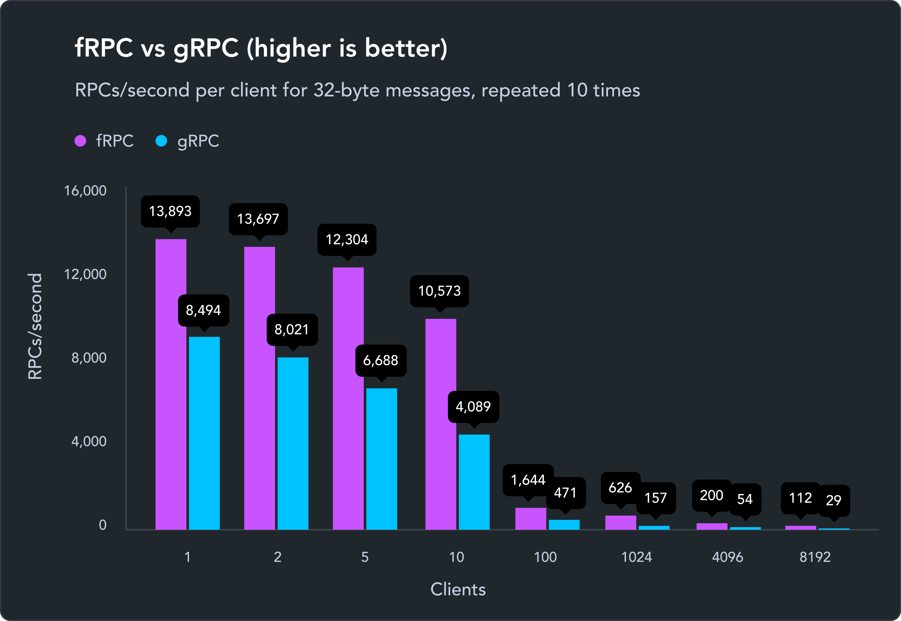
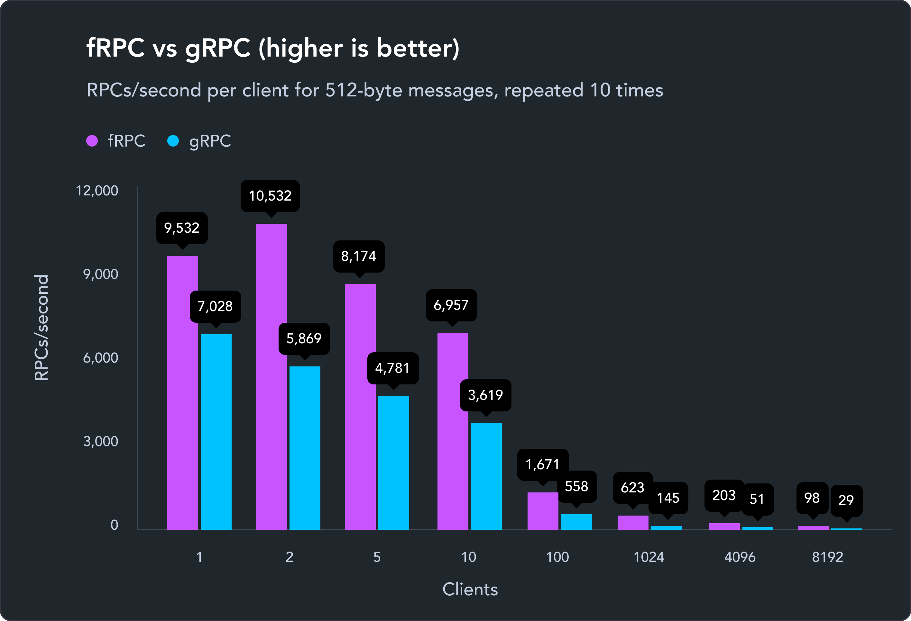
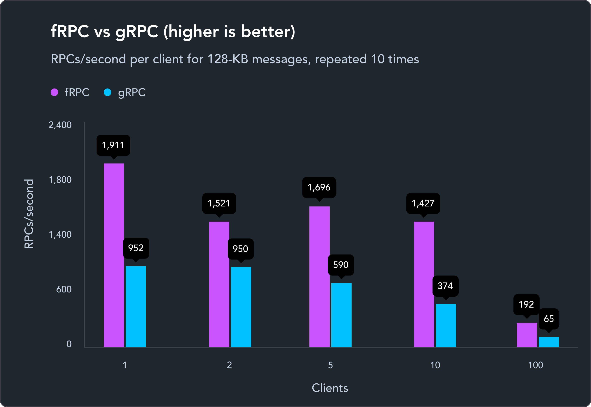
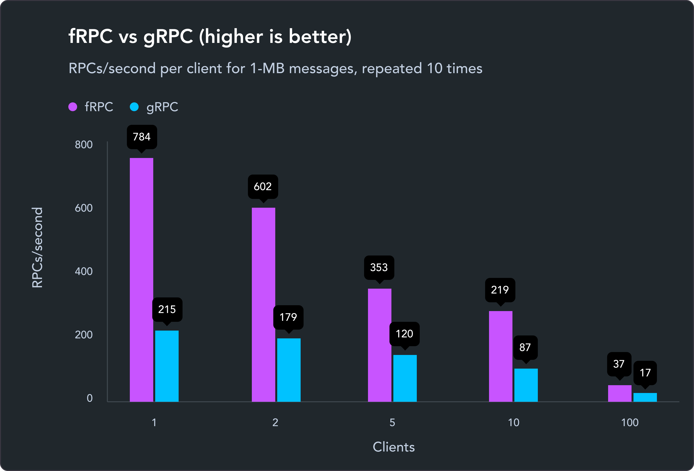
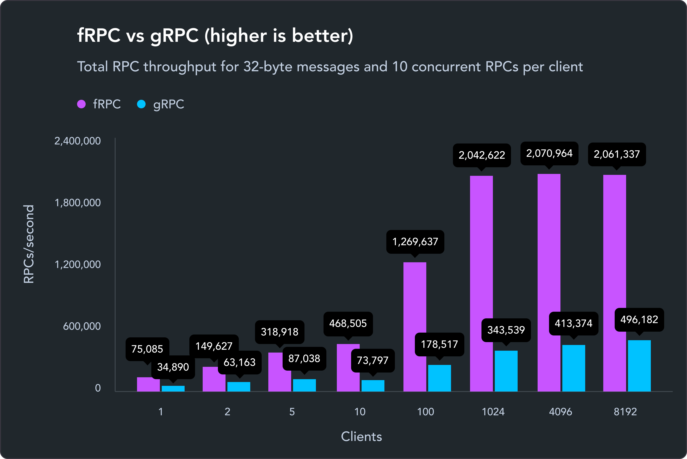
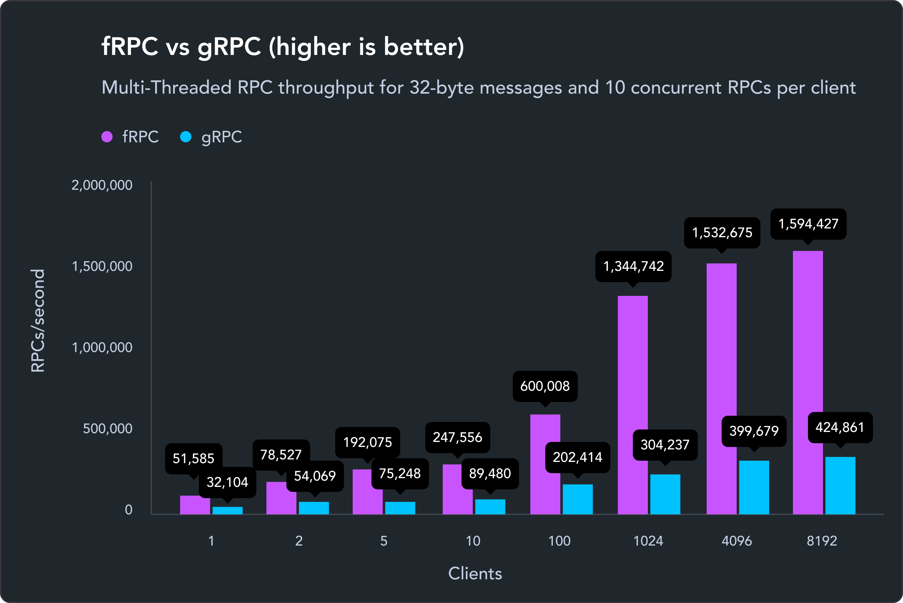

# gRPC Benchmarks

We can't just claim that fRPC is faster than a battle-tested tool like gRPC without backing it up with an apples-to-apples comparison.
These benchmarks are publicly available at [https://github.com/loopholelabs/frpc-go-benchmarks](https://github.com/loopholelabs/frpc-go-benchmarks), and we encourage you to run them for yourselves.

To make sure our benchmark is fair, we'll be using the exact same proto3 file as the input for both fRPC and gRPC.
Moreover, we'll be using **the exact same service implementation for both the gRPC and fRPC** servers - the generated service interfaces in fRPC are designed to look the same as in gRPC,
so using the same service implementation is extremely simple.

```protobuf Benchmark Proto3 File
option go_package = "/";

service BenchmarkService {
  rpc Benchmark(Request) returns (Response);
}

message Request {
  string Message = 1;
}

message Response{
  string Message = 1;
}
```

We'll be running a number of different benchmarks with an increasing number of concurrent clients to show off both the throughput and the scalability of fRPC when compared to gRPC.

The following benchmarks were performed on a bare metal host running Debian 11, 2x AMD EPYC 7643 48-Core CPUs, and 256GB of DDR4 memory. The benchmarks were performed over a local network to avoid inconsistencies due to network latency.

## Client Throughput

For our first set of benchmarks we'll have a number of concurrently connected clients and each client will make RPCs to the fRPC or
gRPC server using a randomly generated fixed-sized message, and then wait for a response before repeating.

In each of our benchmark runs we're increasing the number of concurrently connected clients and we're measuring the average throughput of each client to see how well fRPC and gRPC scale. We're also
running a number of separate benchmarks, each with an increasing message size.

### 32-Byte Messages



Starting with **32-byte** messages, it's obvious from the graph above that fRPC consistently outperforms and outscales gRPC -
often by more than 2x. In the case of 8192 connected clients, fRPC's throughput is still 112 RPCs/second while gRPC drops to only 29.

That means that clients using fRPC get almost 4x more throughput than gRPC using the same services and the same proto3 files.

With 32-byte messages and 112 RPCs/second for fRPC that means our total throughput is about 3584B/s per client. With 8192
clients that means our total throughput is about 28MB/s. for gRPC our total throughput is about 7.25MB/s.

### 512-Byte Messages



Moving to the slightly larger **512-byte** messages, we can see the total throughput seems to drop for each individual client, but
fRPC is still comfortably 2-3x faster than gRPC is. In the case of 8192 connected clients, fRPC's throughput is still 98 RPCs/second while gRPC drops to only 29.

With 512-byte messages and 98 RPCs/second for fRPC that means our total throughput is about 49KB/s per client. With 8192
clients that means our total throughput is about 392MB/s. for gRPC our total throughput is about 116MB/s.

### 128-KB Messages



Now we're moving to the next larger message size, **128-KB**. Total throughput drops as expected for each client, but fRPC is still
easily 3-4x faster than gRPC. In the case of 100 connected clients, fRPC's throughput is 192 RPCs/second while gRPC drops to only 65.

With 128KB messages and 192 RPCs/second for fRPC that means our total throughput is about 24MB/s per client.
With 100 clients that means our total throughput is about 2.34GB/s. For gRPC our total throughput is only about 0.8GB/s.

### 1-MB Messages



With the next largest message size, **1MB**, it's clear that we're starting to become bottlenecked by the bare metal host we're using to benchmark.

Still, fRPC keeps its lead with a 3-4x improvement over gRPC, and in the case of 100 connected clients fRPC's throughput
per client is about 37MB/s. With 100 clients that means our total throughput is about 3.6GB/s. For gRPC our total throughput is only about 1.7GB/s.

## Server Throughput

Now let's look at how fRPC servers scale as we increase the number of connected clients.
For this benchmark, we're going to make it so that each client repeatedly sends 10 concurrent RPCs in order to
saturate the underlying TCP connections and the accompanying RPC server.



As before, we can see that fRPC consistently outperforms gRPC - but as we increase the number of clients it's also
clear that fRPC does not get as slowed down as the gRPC server does. It's able to handle **more than
2,000,000 RPCs/second** and the bottleneck actually seems to be our bare metal host as opposed to fRPC.

In the case where we have 8192 connected clients, we can see that the gRPC server is able to handle just less than 500,000 RPCs/second - whereas **fRPC can easily handle more than 4x that**.

## Multi-Threaded Performance

By default, fRPC creates a new goroutine for each incoming RPC. This is a very similar approach to the one used by gRPC,
and is a good choice for high-throughput applications where handling the RPC can be a blocking operation (like querying a remote
database).

However, fRPC can also be configured to create a single goroutine to handle all the RPCs from
each incoming connection. This is a good choice for applications that require very low latency and where the
handlers are not blocking operations (such as metrics streaming).

The benchmarks above were all run with the single-goroutine option enabled, because our
BenchmarkService implementation is a simple `Echo` service that does little to no processing and does
not block.

It's also important, however, to benchmark an application where the RPCs are blocking operations - and for those we'll go back
to fRPCs default behavior to create a new goroutine to handle each incoming RPC.

Our blocking operation for the following benchmark is a simple `time.Sleep` call that sleeps for exactly 50 Microseconds.



The trend above is very similar to the single-threaded benchmarks above - fRPC is still leading gRPC in throughput, but it's also clear that boht gRPC and fRPC have suffered a performance penalty. For gRPC this is likely because the RPCs are now doing "work" and are blocking operations, but
for fRPC it's a mixture of the added computation as well as the multi-threaded behaviour.

In the case where we have 8192 connected clients, we can see that the performance of fRPC has dropped from 2,000,000 RPCs/second to about 1,600,000 RPCs/second, and gRPC has dropped from 500,000 RPCs/second to about 400,000 RPCs/second.

These benchmarks show off just a small portion of fRPCs capabilities, and we encourage everyone to run
these for themselves. We also have [benchmarks comparing fRPCs messaging format with protobuf and other serialization frameworks](https://github.com/loopholelabs/polyglot-go-benchmarks).
